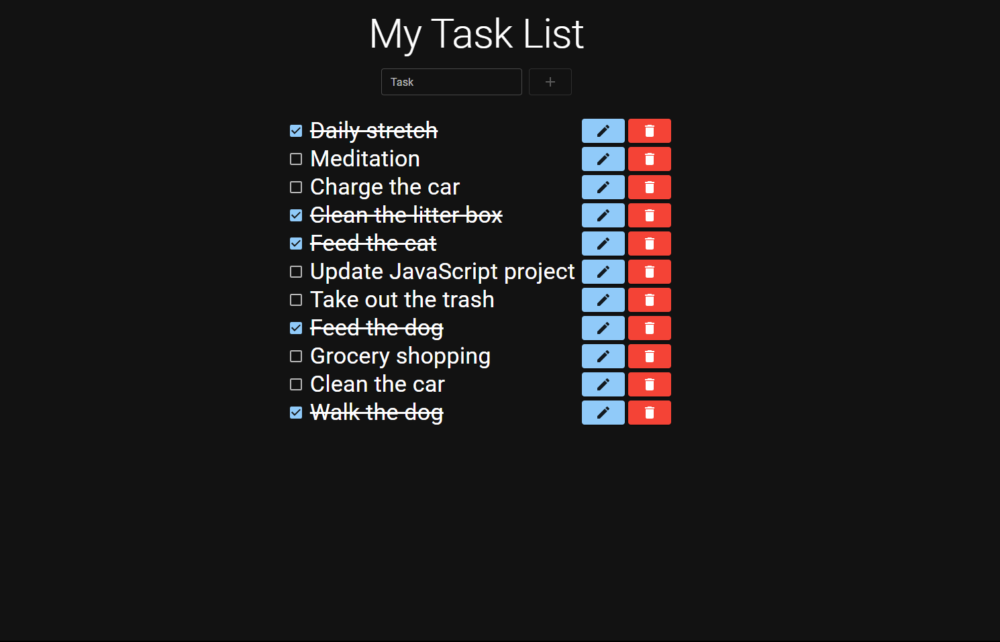

# Full Stack React Task List (CRUD)

## Technologies Used

DynamoDB | Lambda | Amplify | Express | React | Node

## Application

A task list that can add/delete/update/ and cross out tasks. The project was built using React as the frontend UI and Node.js/Express.js for the backend. 

## Deployment

The project was deployed to Amazon Web Services using DynamoDB and Lambda to house the database and Amplify to build and deploy the UI.

## See It In Action

Visit the link in the About section to see the project live. There, you can interact with the web application in real-time.
